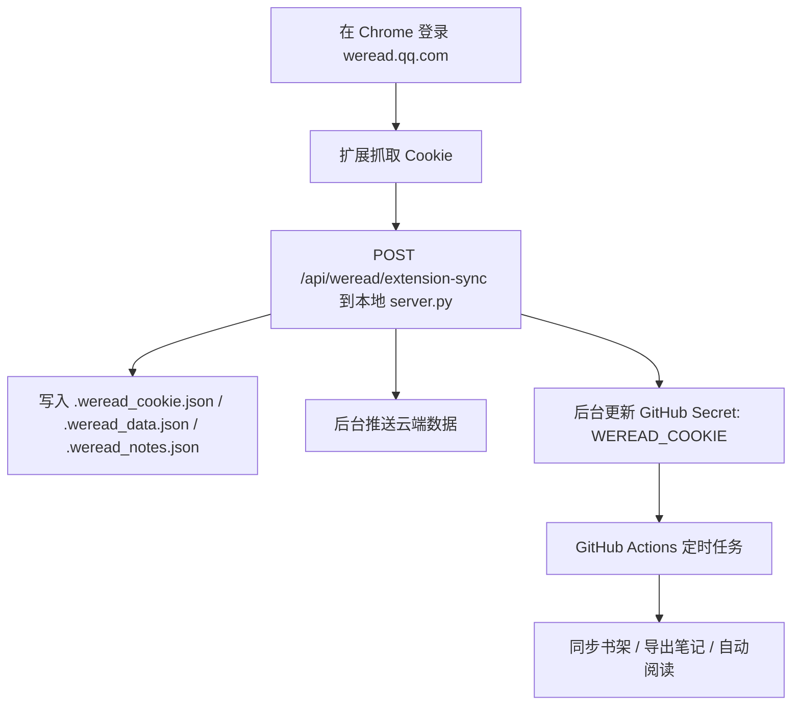

# dx-weread

一个本地优先的任务管理面板，已经接入微信读书同步，支持把书架、最近阅读动态和读书笔记放进同一个 Dashboard 里。

## 现在能做什么

- 管理日常任务、每周任务和长期任务
- 展示学习书架与微信读书书架
- 从微信读书同步最近阅读、划线、高亮和评论
- 把微信读书笔记单独存到本地文件，和主业务数据分开
- 用 Chrome 扩展在登录态下自动抓取 Cookie 并后台同步
- 预留一个桥接接口，方便后续接微信小程序或云端同步

## 本地运行

### 1. 安装依赖

```bash
python3 -m pip install -r requirements.txt
```

### 2. 启动服务

```bash
python3 server.py
```

默认访问地址：

- `http://127.0.0.1:8080`
- `http://localhost:8080/dashboard.html`

如果后面要挂到自己的服务器上，可以用环境变量改监听地址：

```bash
TASK_APP_HOST=0.0.0.0 TASK_APP_PORT=8080 python3 server.py
```

## 微信读书同步方式

### 纯本地自动同步（推荐）

如果你的目标是“只在这台 Mac 上稳定自动同步”，最省心的方案是不依赖 Chrome 扩展，也不依赖 GitHub Actions。

项目已经支持：

- 首次手动粘贴一次 Cookie，或从 Chrome/扩展同步一次
- 后台默认直接使用项目本地保存的 `.weread_cookie.json`
- 不需要每次读取 macOS 钥匙串，所以不要求系统密码
- 后台按固定间隔自动同步书架和笔记
- 如果配置了 `API_TOKEN`，同步后会顺手推送到你的云端 `yangminggu.com/tasks`

一键切到纯本地模式：

```bash
bash scripts/setup_local_weread_sync.sh
```

默认每 2 小时自动同步一次；如果想改成每 1 小时：

```bash
bash scripts/setup_local_weread_sync.sh 1
```

切好之后：

1. 打开本地页面 `http://127.0.0.1:8080/dashboard.html`
2. 首次任选其一：
   - 手动粘贴 Cookie
   - 点“从 Chrome 自动同步”
   - 用 Chrome 扩展同步一次
3. 之后就交给本地后台服务

这个模式下，GitHub secret 自动同步会默认关闭。

### 混合方案触发流程

首次抓取登录态和恢复同步，靠的是**本地 Chrome 扩展**；后续定时备份、云端同步和自动阅读，靠的是 **GitHub Actions**。



### 方式一：Chrome 扩展自动同步

扩展目录在：

- `chrome-extension/weread-sync`

加载方式：

1. 打开 `chrome://extensions/`
2. 开启开发者模式
3. 点击“加载已解压的扩展程序”
4. 选择 `chrome-extension/weread-sync`

扩展会在你登录 `weread.qq.com` 后尝试读取当前请求里的 Cookie，并发给本地服务同步。

### 方式二：手动导入 Cookie

后端支持把 Cookie 保存到本地：

- `.weread_cookie.json`

之后同步接口会优先使用你传入的 Cookie，没有传入时就回退到本地保存的 Cookie。

### 方式三：桥接到后续小程序 / 云端

后端已经提供：

- `POST /api/weread/bridge-token`
- `POST /api/weread/mini-sync`

这部分是给后续的小程序、云函数或者你自己的线上服务做桥接准备的。现在它还不是完整的小程序方案，但已经把数据入口预留好了。

## 数据文件说明

项目里把“应用自己的数据”和“微信读书同步数据”拆开了：

- `data.json`
  主应用数据，比如任务、项目、笔记与文档等
- `.weread_data.json`
  微信读书书架、最近动态、同步时间等
- `.weread_notes.json`
  微信读书笔记明细，包括划线和评论
- `.weread_cookie.json`
  本地保存的 Cookie
- `.weread_bridge.json`
  小程序 / 云端桥接 token 与状态
- `.backups/`
  本地数据备份

其中带前缀 `.` 的微信读书本地文件和备份目录已经加入 `.gitignore`，不会被推到 GitHub。

## 仓库结构

```text
.
├── dashboard.html
├── server.py
├── requirements.txt
├── chrome-extension/
│   └── weread-sync/
│       ├── manifest.json
│       ├── background.js
│       ├── popup.html
│       ├── popup.js
│       └── README.md
└── .github/
    └── workflows/
```

## GitHub 上现在建议怎么用

这个仓库现在最适合做两件事：

- 用 GitHub 保存代码版本和功能演进
- 用 GitHub Actions 做基础检查，避免改坏服务端或扩展脚本

## Cloudflare Worker 版本

仓库里已经有一套给 `yangminggu.com/tasks` 用的 Worker 代码：

- Worker 入口：`src/index.js`
- Worker 配置：`wrangler.jsonc`
- 线上页面静态资源：`public/tasks/index.html`

本地改完 [dashboard.html](/Users/liubike/Desktop/任务管理App/dashboard.html) 后，可以用下面这条命令把云端用的页面副本同步好：

```bash
npm run sync:dashboard
```

现在这套 Worker 会：

- 直接服务 `https://yangminggu.com/tasks`
- 用 KV 保存 `tasks / books / notes / updates`
- 把前端请求自动走到 `/tasks/api/*`
- 在云端页面里提示“微信读书同步先走本地版”

## 把本地数据推到云端

已经准备好一个一次性上传脚本：

- `scripts/push_cloud_data.py`

用法：

```bash
python3 scripts/push_cloud_data.py https://yangminggu.com/tasks
```

它会读取你本地当前的合并数据，然后 POST 到云端 Worker 的 `/api/data`，把任务、书架、笔记和动态一起推上去。

等你后面决定要正式上线，再接下面其中一种部署路线会更顺：

- 传统云服务器或轻量应用服务器，直接跑 `python3 server.py`
- 把前端和后端拆开，前端挂站点，后端部署成单独服务
- 用 GitHub Actions 配合部署脚本，把更新自动发到你的服务器

## 下一步比较推荐

如果目标是挂到 `yangminggu.com`，建议顺序是：

1. 先把这个仓库当成唯一代码源
2. 先在本地把功能跑稳
3. 再决定线上是保留一体化 Flask，还是拆成前端站点 + API
4. 最后再接你的小程序或自动化同步链路
