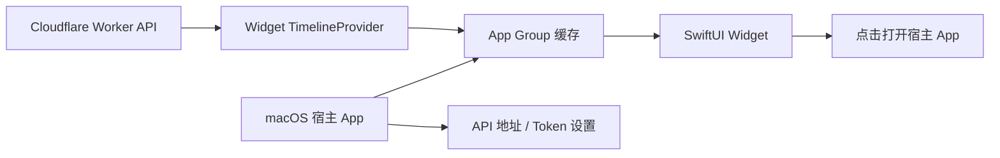

# macOS 小组件模块 README

调研日期：2026-05-29

## 当前实现进度

已经开始在本文件夹内实现原生 macOS Widget MVP：

- `App/`：SwiftUI 宿主 App，用于保存 Worker API 地址/API Token、测试刷新、触发 Widget timeline reload。
- `WidgetExtension/`：WidgetKit 小组件，支持 small / medium / large 三种尺寸。
- `Shared/`：Worker API Client、数据模型、统计快照、App Group 缓存、阅读圆环视图。
- `Config/`：App 和 Widget Extension 的 plist / entitlements。
- `project.yml`：XcodeGen 工程描述。
- `BUILD.md`：生成 Xcode 工程和运行说明。

## 结论

可以把现有小程序的核心展示功能做成 macOS 原生 Widget，推荐路线是 **SwiftUI + WidgetKit**，外加一个很薄的 macOS 宿主 App 用来保存 API 配置、打开设置页、承载 Widget Extension。

Tauri / Electron 可以复用 Web 技术做一个菜单栏 App、桌面悬浮窗或完整桌面客户端，但它们不能直接产出 macOS 桌面/通知中心里的系统 Widget。若目标是“像系统小组件一样放在 macOS 桌面或通知中心”，必须走 WidgetKit。

## 资料依据

- Apple WidgetKit：WidgetKit 用 SwiftUI 渲染小组件，并通过 timeline 机制更新内容；Mac 上的小组件可以放在桌面和通知中心。  
  https://developer.apple.com/documentation/widgetkit
- Apple 小组件更新机制：Widget 扩展不是持续运行进程；系统按 timeline、App 主动 reload 或 WidgetKit push 来更新，并有刷新预算。Apple 文档给出的常见预算大约是每天 40-70 次刷新。  
  https://developer.apple.com/documentation/widgetkit/keeping-a-widget-up-to-date
- Apple 小组件交互与设计：小组件适合 glanceable content 和 focused interactions，支持 deep link 到 App，也可以用 App Intents 做按钮/开关，但不应做成完整 App。  
  https://developer.apple.com/design/human-interface-guidelines/widgets  
  https://developer.apple.com/documentation/widgetkit/linking-to-specific-app-scenes-from-your-widget-or-live-activity
- Tauri：Tauri 是跨平台桌面应用框架，macOS 上使用系统 WebView；官方支持系统托盘、窗口等桌面 App 能力。  
  https://v2.tauri.app/reference/webview-versions/  
  https://v2.tauri.app/learn/system-tray/
- Electron：Electron 用 Chromium 和 Node.js 构建桌面 App，可创建 BrowserWindow、Tray、透明/置顶窗口等。  
  https://www.electronjs.org/  
  https://www.electronjs.org/docs/latest/api/browser-window  
  https://www.electronjs.org/docs/api/tray/

## 现有项目可复用点

当前小程序已经把数据层抽成了 Worker API：

- 小程序接口文件：`miniprogram/src/api/index.js`
- Worker 主逻辑：`worker/src/index.js`
- 云端入口：`https://yangminggu.com/tasks`

Widget MVP 可以直接读：

```http
GET https://yangminggu.com/tasks/api/data
Authorization: Bearer <API_TOKEN>
```

返回数据里可直接用的字段：

- `tasks`：任务列表，包含 `status`、`taskType`、`priority`、`category` 等。
- `books`：微信读书书架。
- `weekReadDaily`：按日聚合的阅读分钟数。
- `totalReadDays`：累积完成阅读天数。
- `wereadStats.dailyReadTimes`：每日阅读记录，可计算连续达标天数。

注意：当前 Worker 只校验非 GET 写接口，`GET /api/data` 目前不强制 token。做 macOS Widget 前建议补一个更安全的只读摘要接口，或者让 GET 也校验 Bearer token。

## WidgetKit 方案

### 架构



组件：

- macOS App：设置 API Base URL、API Token、刷新按钮、打开云端网页。
- Widget Extension：拉取 Worker API，生成 timeline entry。
- App Group：宿主 App 和 Widget 共享缓存、配置。
- URL Scheme：点击 Widget 打开宿主 App 的任务页或阅读页。

### 推荐展示范围

第一版只做“看一眼就够”的内容：

- 今日任务：今日/本周未完成数、已完成数、完成率。
- 圆环：复用“小程序阅读圆环”的语义，展示今日阅读分钟 / 30 分钟目标。
- 阅读统计：今日阅读、连续完成天数、累积完成天数。
- 任务列表：中号/大号 Widget 展示 3-6 条高优先级未完成任务。

建议支持三种尺寸：

- Small：阅读圆环 + 今日分钟数。
- Medium：阅读圆环 + 今日任务进度 + 连续/累积天数。
- Large：Medium 内容 + 高优先级任务列表。

### 交互边界

任务三里写“macOS widget 基本只读，点击只能跳转 App”，这个判断需要稍微更新：

- 现在 WidgetKit 可以做简单按钮和开关，通常通过 App Intents 执行轻量动作。
- 但 Widget 仍然不是常驻 App，不能承载复杂编辑流程，也不能指望秒级实时同步。
- 对当前项目，MVP 应接受“主要只读 + 点击打开 App/网页”。
- 第二阶段才考虑“勾选完成任务”这种 App Intent 写接口，因为它需要处理鉴权、失败回滚、刷新预算和并发状态。

### 数据刷新策略

推荐 timeline：

- 普通刷新：每 30-60 分钟请求一次 `/api/data`。
- 早晨/午间/晚间：可在 timeline 里加密集一点的刷新点，比如 09:00、12:00、18:00、23:00。
- 手动刷新：宿主 App 内点击刷新后调用 WidgetCenter reload。
- 失败兜底：Widget 使用最近一次 App Group 缓存，显示 `上次更新 HH:mm`。

Apple 对 Widget 刷新有系统预算，不适合做“实时任务看板”。但对任务进度、阅读时长这类低频数据足够。

### Swift 侧数据模型草案

```swift
struct DashboardData: Decodable {
    var tasks: [TaskItem]
    var books: [BookItem]?
    var weekReadDaily: [String: Int]?
    var totalReadDays: Int?
    var wereadStats: WereadStats?
}

struct TaskItem: Decodable, Identifiable {
    var id: Int
    var title: String
    var category: String?
    var status: String?
    var priority: String?
    var taskType: String?
}

struct WereadStats: Decodable {
    var dailyReadTimes: [DailyReadTime]?
}

struct DailyReadTime: Decodable {
    var date: String
    var seconds: Int?
    var minutes: Int?
}
```

### TimelineProvider 草案

```swift
func getTimeline(in context: Context, completion: @escaping (Timeline<Entry>) -> Void) {
    Task {
        let snapshot = await api.fetchDashboardData() ?? cache.loadLastSnapshot()
        let entry = WidgetEntry(date: Date(), snapshot: snapshot)
        let next = Calendar.current.date(byAdding: .minute, value: 45, to: Date())!
        completion(Timeline(entries: [entry], policy: .after(next)))
    }
}
```

## Tauri / Electron 对比

| 维度 | SwiftUI WidgetKit | Tauri | Electron |
|---|---|---|---|
| 是否是真 macOS 系统 Widget | 是 | 否 | 否 |
| 可放桌面/通知中心 | 是 | 否，只能做窗口/菜单栏/托盘体验 | 否，只能做窗口/菜单栏/托盘体验 |
| 技术栈 | Swift / SwiftUI / WidgetKit | Rust + Web 前端 + 系统 WebView | Node.js + Chromium + Web 前端 |
| 复用现有 Web/Taro 代码 | 低，需要重写 UI | 中，可复用 Web 思路和部分 JS 逻辑 | 中高，Web 复用最顺 |
| 体积和资源 | 最轻、最系统 | 较轻，依赖系统 WebView | 通常最重，因为自带 Chromium/Node |
| 交互能力 | 轻交互，适合 glanceable | 完整桌面 App 交互 | 完整桌面 App 交互 |
| 后台刷新 | 受 WidgetKit timeline 预算约束 | App 可常驻后台/菜单栏 | App 可常驻后台/菜单栏 |
| 推荐用途 | 正式 macOS 小组件 | 菜单栏小面板、设置工具、跨平台桌面版 | 快速做完整桌面客户端 |

判断：

- 如果目标是“macOS 小组件”：选 WidgetKit。
- 如果目标是“打开一个轻量面板管理任务”：Tauri 比较合适。
- 如果目标是“最快复用网页能力做桌面客户端”：Electron 成本最低但体积和常驻资源最高。

## 建议落地路线

### Phase 1：原生只读 Widget MVP

目标：验证“桌面 glanceable 是否真的好用”。

- 新建 Xcode macOS App + Widget Extension。
- 实现 `GET /tasks/api/data` 拉取。
- App Group 缓存最近一次数据。
- Small / Medium 两种尺寸。
- 点击 Widget 打开宿主 App 或 `https://yangminggu.com/tasks`。

验收：

- 无需本地 Flask，关掉本地服务也能显示云端数据。
- 断网时显示最近缓存。
- 今日阅读圆环和小程序语义一致。
- Medium 能看到今日任务完成率和 3 条待办。

### Phase 2：安全和摘要接口

目标：让 Widget 数据更小、更安全。

- Worker 新增 `GET /api/widget-summary`。
- 返回 Widget 需要的摘要，而不是完整 `tasks/books/notes`。
- GET 接口要求 Bearer token。
- 宿主 App 用 Keychain 或 App Group 配置保存 token。

建议摘要结构：

```json
{
  "date": "2026-05-29",
  "tasks": {
    "total": 8,
    "completed": 3,
    "active": 5,
    "top": [
      { "id": 1, "title": "写作业", "priority": "high", "taskType": "daily" }
    ]
  },
  "reading": {
    "todayMinutes": 24,
    "goalMinutes": 30,
    "streakDays": 5,
    "totalReadDays": 123
  },
  "updatedAt": "2026-05-29T10:00:00+08:00"
}
```

### Phase 3：轻交互

目标：只加最有价值的动作。

- 任务完成按钮：App Intent 调 Worker `POST /api/tasks/update`。
- 刷新按钮：App Intent 触发 reload timeline。
- 风险：失败状态、token 失效、重复点击、Widget 刷新预算都要处理。

## 不建议做的事

- 不建议用 Tauri/Electron 冒充系统 Widget。悬浮窗无法进入 macOS Widget Gallery，也不会出现在通知中心，行为和用户预期不同。
- 不建议第一版支持新增/编辑任务。Widget 里做表单体验差，应该 deep link 到宿主 App 或网页。
- 不建议 Widget 每几分钟刷新。WidgetKit 不保证这种频率，还会浪费系统预算。

## 最终建议

任务三的可行性结论是：**能做，且应该做原生 WidgetKit 版。**

范围建议锁死在“今日任务进度 + 阅读圆环 + 关键阅读统计 + 少量高优先级任务”。Tauri/Electron 作为后续“菜单栏任务面板”可以单独规划，但不应作为 macOS 小组件路线。
