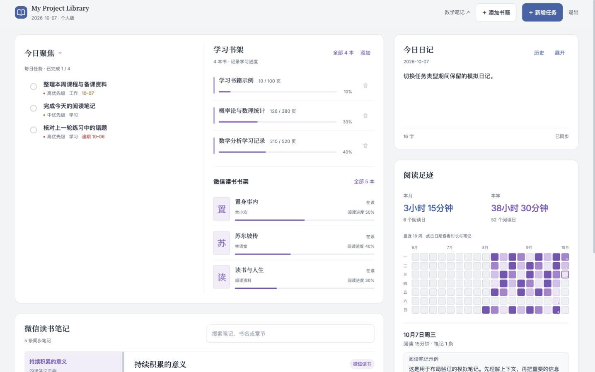
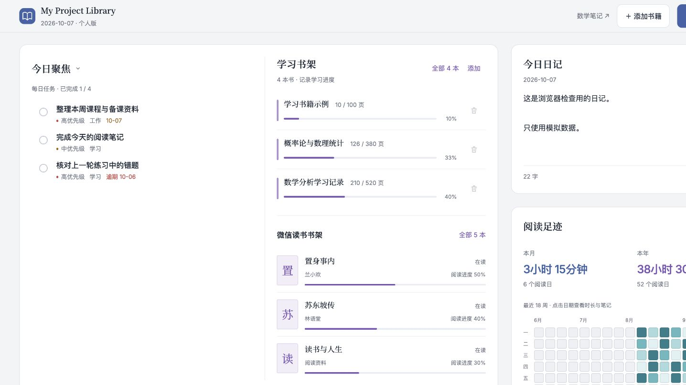

# 网页工作台设计思路

更新：2026-10-07。适用于网页版 iPad / Mac 宽屏。当前实现以文末最新确认记录为准；前文保留为迭代记录。本文件随设计一起维护；修改前重读目标和取舍，截图后再次逐项检查，并记录下一轮修正。源码模块化不等于把界面分成多个页面。

## 用户要求与原设计基线

保留最初的单页工作台。上方依次为今日聚焦、学习书架、日记；中间是每日 / 本周 / 长期计划；下方是微信读书书架、笔记和阅读热力。重要内容实际显示，主要操作在原处完成。用户明确否决模块导航和顶部汇总长条。财务不在本轮范围内。

原设计更好的地方是标题在容器外、文字有阅读感、今日任务紧凑、书架像列表、日记像一张纸。上一版误把“看板”理解为统一的大卡片：新增重复汇总、每列拉高、计划套卡片、粗蓝色横线，导致阅读区被推到很下面。修正应沿用原设计的内容顺序、标题和轻量列表，而不是再加装饰。

## 具体设计师与作品

用户要求必须写清楚大师 / 设计团队和实际作品。以下区分作品结构参考与个人设计原则；不能把当代 iCloud 页面直接归为 Jony Ive 的个人作品。

### 苹果设计团队：iCloud.com 首页——本轮最相近的作品参考

来源：[Apple 官方产品页面](https://www.apple.com/icloud/)、[官方首页设计图](https://www.apple.com/v/icloud/ak/images/overview/always_on__djk4uvw7xmky_large.jpg)、[Apple 支持：首页内容块与快捷操作](https://support.apple.com/guide/icloud/customize-and-use-the-homepage-tiles-mm048a5aa9cc/icloud)。已实际查看官方设计图，而非只读文字规范。

相近之处：照片、邮件、文件、备忘录内容集中显示，内容块内部承担信息和操作。与用户最初的任务 / 书架 / 日记并排组织相似。借鉴的是“多种实际内容同页可见”，不是只显示应用图标或摘要数字；也不是去模仿 iCloud 的蓝色壁纸、透明面板及版式。

对应到本项目：`DashboardPage.jsx` 不设导航及汇总长条；任务、书架、日记仍在首排直接显示；阅读内容同页展开。保留用户熟悉的三列顺序，任务、书架、日记按照内容职责自然决定高度。全部书架入口靠近所属标题。

### Jony Ive：苹果 iOS 7 的设计阐述——清晰、秩序和效率

来源：[Apple Newsroom，2013 年发布 iOS 7](https://www.apple.com/newsroom/2013/06/10Apple-Unveils-iOS-7/)。官方发布稿引用了当时设计负责人 Jony Ive 对简洁的解释：简洁不仅是减少装饰，还要给复杂内容建立秩序。这里使用其公开表达的原则，不声称他设计了当前 iCloud 首页。

为什么适合：本项目包含任务、阅读、日记等不同信息。问题不是功能太多，而是上一版重复统计和同样大小的容器掩盖了内容层级。

对应改动：标题在容器外、正文优先、主要操作蓝色而次要操作降低强调；去掉计划区粗色带、重复筛选和大面积背景；减少嵌套容器。保持原来的衬线标题与宽屏结构，不照搬 iOS 的手机布局，也不采用 iOS 7 的极细字重。

### Dieter Rams：优秀设计十原则——有用、清楚、克制

来源：[Vitsœ 官方，Dieter Rams 的设计原则及作品](https://www.vitsoe.com/us/about/good-design)。重点阅读其让产品易懂、不喧宾夺主、减少非必需元素这几条原则。它们出自工业设计，应用到网页是本项目的判断。

为什么适合：这是每天使用的学习工作台，界面应让用户读书名、读正文、完成任务，而不是让装饰抢占注意力。

对应改动：明确删除用户否决的汇总条；来源已由“微信读书书架”标题说明，不在每本书上重复贴徽标；同一待办不重复出现；月 / 年数据留在阅读区，取消统计大卡片。字号、栅格、留白和具体颜色仍按用户原设计和实际宽度校验，不能以大师姓名代替审美检查。

## 辅助参考与应用边界

| 来源 | 已核对的内容 | 本项目采用的判断 | 边界 |
|---|---|---|---|
| 用户最初的 `dashboard.html`（Git HEAD） | 三列日常内容、三类计划、书架、左笔记右热力 | 是布局的第一参考，保留熟悉的位置和单页动线；外置标题使内容区更轻 | 保留日记与书籍的新保存保护，不回退旧业务写入 |
| [Notion Dashboards](https://www.notion.com/help/dashboards) | 同页多来源内容、列宽 / 行高、筛选与内容操作 | 借鉴同页组织，而不是指标大卡片；每块只承担一个明确职责，减少同一内容重复展示 | 不采用切换模块的导航，不添加没有实际用途的统计 |
| [Basecamp Project page](https://basecamp.com/features) | 项目页集中任务、讨论、资料等工作工具 | 借鉴“内容本身就是工作台”；任务、书籍、日记彼此不同，无需统一成相同的大块外壳 | 不复制团队后台、导航和营销页外观 |
| [Apple UI Design Dos and Don’ts](https://developer.apple.com/design/tips/) | 适配屏幕、文字可读、控制贴近所改内容、相关信息对齐、触控命中区域 | 保留蓝灰白色和清楚的文字层级；删去粗装饰，操作靠近内容，iPad 常用操作保留至少 44 CSS px 命中区域 | 这是网页适配判断，不声称复刻 Apple 产品或获得 Apple 设计认可 |
| [37signals / Shape Up — Find the Elements](https://basecamp.com/shapeup/1.3-chapter-04) | 先明确要素、操作和连接，再进入视觉细节 | 先写每块内容的职责与操作，再调整视觉；截图发现偏离时回到本说明重新判断 | 参考其设计过程，不把文档当作审美质量的证明 |

以上是明确的借鉴及本项目的取舍，不是来源要求我们使用这些具体字号、边框或栅格。最终视觉需要由截图和用户反馈判断。

## 前两轮决策与原因（历史记录，当前布局以第 3 轮为准）

1. **删除顶部汇总长条。** 用户明确否决；待办和完成数在任务区，阅读数据在阅读区，日记日期和状态在日记区。集中一条反而产生冗余和无意义扫描。
2. **恢复容器外标题。** 三列标题使用原设计的衬线文字，主体保持白色轻边界；不把标题、说明、筛选、列表和页脚全部塞进一个大框。说明统一放在标题下，左边缘对齐。
3. **今日聚焦只显示每日待办。** 恢复原来的职责，默认三项，完成在原地进行；其余每日任务进入计划区，不再把每周与长期重复塞进聚焦区。不重复显示同一项任务。
4. **学习书架恢复紧凑列表。** 书名优先，页数和细进度线次之，删除是次要操作；默认三本，更多原地展开，不用巨大的空白页脚撑高。
5. **日记保持纸面。** 日期、正文、保存状态分别在顶部、中心、底部，历史和展开靠近标题。常态纸面区域约 214px；长文通过展开继续写，不把首页变成长文编辑器。
6. **计划去掉粗蓝线和卡片套卡片。** 三列维持分类，列头和进度说明对齐，任务用平整列表与分隔线区分。默认每列最多三条，其余原地展开，正文自然决定高度。
7. **阅读区收紧。** 微信读书书架保留三本并排，减少装饰标签。笔记列表 / 正文与热力图并排；月 / 年数据放在热力图所属区域，不另外制造统计大卡片。笔记常态阅读区约 360px，长文在阅读区继续阅读。
8. **宽度与字体。** 宽屏使用最大 1560px 内容列，1440px 下左右留 36px，1024px 下留 24px。保持三列日常区与三列计划；正文 14–15px、标题 17–18px、小字 11–12px。留白服务分组，不用等高的大空壳补齐页面。

## 每轮改动前后要重读的检查

- 页面是否仍从三列日常内容开始？是否新增了用户否决的导航或汇总长条？
- 同一条待办是否重复出现在聚焦和计划中？每块是否有独立职责？
- 标题是否清楚且与说明左对齐？是否出现粗色条、厚阴影、无内容的大块占位？
- 是否因为宽屏就把中文正文和控件无限拉长？1024px 是否仍能正常阅读？
- 日记、书架、笔记是否仍能直接操作？展开 / 收起是否保留原来的草稿和选中内容？
- 空数据、长标题、多条记录是否诚实显示且没有横向溢出？触控和键盘操作是否正常？
- 最初设计的熟悉感是否保留？如答案是否，先记录具体问题再修改，不用“参考了大厂”解释截图中的缺陷。

## 迭代记录

### 第 1 轮：修改前复读

重新读取原设计、用户否决和上面的检查。确定先删汇总条，恢复外置标题和内容自然高度，再清理重复任务、计划嵌套容器和多余统计卡。保存控制器与 API 不变。

后续截图检查按实际结果记录，不预先写“更好看”或“通过”。

### 第 1 轮：截图后复读

1440×900 模拟截图确认汇总条已删除、外置标题恢复、待办没有重复、粗蓝线和嵌套卡片已移除。仍有具体问题：首排高度约 302px；微信读书卡仍保留上一版重复来源标签和偏大的垂直间距；笔记时间直接显示 ISO 字符串。全文高度约 1827px，笔记区域从约 1017px 开始，阅读内容还可以前移。

### 第 2 轮：修改前复读

再次读取用户要求、借鉴边界和检查项。保持三列与原有顺序，缩短日记的常态纸面及计划列表行距；微信读书恢复紧凑书架，来源已经由标题说明，去掉重复徽标；日期改为便于阅读的显示文字。缩短页面靠删重复和压缩无效间距，不靠降低正文可读性。默认仍展示三本，全部数据可原地展开。

### 第 2 轮：截图后复读与用户补充

首排从约 302px 收紧到 274px，笔记区域从约 1017px 前移到 899px；同一批模拟数据的全文高度由约 1827px 降至 1693px。以上为内部两轮比较，并非对原设计的审美评分。1440px 下保留衬线外置标题、紧凑书籍列表和单层计划列表。

用户进一步要求写明大师与作品，因此补看苹果官方 iCloud 首页设计图，并新增 Jony Ive 和 Dieter Rams 的具体来源、借鉴理由、对应文件和取舍边界。重新读取后确认：当前结构以用户原设计为第一参考，iCloud 为相近作品参考；个人设计原则只指导清晰、克制和删重复，不用来包装任意添加的控件。

### 第 2 轮结构与交互核对

1024×768、1440×900、1920×1080 保持三列日常区；768×1024 为两列加日记，375×812 保持兼容。所有尺寸均无横向溢出、无模块导航、无汇总条；计划进度说明及热力图说明与所属标题左边缘一致。浏览器验证第四项每日任务留在计划区，完成聚焦任务后自动补位且不重复；日记历史 / 展开 / Escape 保存对应日期；笔记搜索在任务刷新后保留。模拟检查不等于 iPad 实机验收，审美结果交由最终截图与用户反馈判断。

最后一遍复读检查补充：任务详情的标题与附属信息合并为同一个可点击区域，聚焦区实测 44px、计划区实测约 52px，保持紧凑同时保留 iPad 命中范围；学习书籍表单改名后页数不变。40 项网页检查、Worker dry-run 打包和源码差异检查通过。所有浏览器修改只针对独立模拟数据，未部署、未修改真实业务数据。

## 第 3 轮：从恢复原版到实际优化

用户确认上一轮主要恢复了原版，仍要求进一步优化。本轮先重读前面的来源与用户否决，再改变内容的组合方式。以下决策取代前文“计划管理必须独占全宽一行”的限制；用户要求保留的是单页、三列起点和熟悉的内容，而非原版每一行的固定高度。

### 作品细节与改动的对应

苹果 iCloud 官方设计图中，照片 / 邮件使用较宽内容块，个人信息 / 文件使用较窄内容块；它把不同容量的内容放进统一栅格。我们据此采用左侧两列工作区加右侧一列的布局，左侧下方给笔记完整的两列宽度，右侧日记和热力图连续排列。不是照抄外观，而是利用内容容量来决定跨度。

Jony Ive 所说的秩序在本轮落为“同一类内容连续”：每日、本周、长期任务沿左列阅读，学习书架与微信读书沿中列阅读；减少眼睛在全宽行之间来回跳转。Dieter Rams 的删减原则落为取消只有一句提示的每日空卡，以及将重复的随机笔记回顾收为一则可换看的摘录，保留有用内容。

### 布局决策

- 整体仍从任务、学习书架、日记三列开始，无导航、无顶部汇总条。
- 左侧任务区：今日列表直接显示每日进度，更多每日待办在原处展开；下接本周、长期列表。每日待办只有一个所属位置。
- 中间书架区：学习书籍和微信读书上下相邻，不再让微信读书等待整个计划行结束。
- 右侧记录区：日记后接阅读热力与所属统计；日记、阅读习惯在同屏可见。
- 左中两列下方：笔记列表和正文得到连续的宽幅阅读区；正文不用挤成第三个窄栏。
- 阅读回顾只展示一则带正文预览的摘录，提供“换一条”，避免与完整笔记列表重复铺满页面。
- 视觉层级：区域标题 18px，任务和书名 14–15px，页数与日期 11–12px；主要工作内容保持白底，次要信息靠字号与浅色区分。颜色继续使用已有蓝灰白。
- 空状态要与实际数据相符，加载、未开始、全部完成分别表达。常用按钮保持可点击面积，不用缩小控件换取密度。

### 本轮验收目标

同一份模拟数据、1440×900 下，首屏能同时看到三类任务、两类书架、日记与热力图，笔记正文在一次短滚动内可读；不产生三列计划不同长度造成的整行留白。1024px 仍可辨认三列起点，较窄时自然重排。验证日记草稿、书籍编辑、任务完成、全部列表与笔记选择，不改变保存协议。

### 第 3 轮：首次截图后复读

1440×900 下，新结构让三类任务和热力图同屏，但任务每行约 64px，分组间隔近 100px；笔记仍从约 867px 开始，尚未达到明显前移的目标。热力图笔记角标伸出格子，造成约 1px 的横向溢出。再次对照“留白服务分组”和宽屏首屏目标：下一步把任务行收紧到约 52px，保留 44px 完成按钮；缩短分组上边距，把热力角标收进格子，不缩小正文换取空间。

### 第 3 轮：最终截图后复读

这轮与原版的实质区别是重组内容跨度和阅读顺序：任务 / 书架共用一张宽纸面，通过共享栅格与细竖线分栏；日记 / 热力各有自然高度，笔记占左侧两列。标题随各自纸面放入统一内边距，以减少外置标题与多层边框交替造成的断裂。保留衬线区域标题和蓝灰白配色，不添加装饰性色带。真实微信读书封面来自已有 `book.cover` 字段；无封面或加载失败时显示书名首字，截图使用的模拟记录没有封面。

同一份模拟数据，1440×900 的笔记区域从上一轮约 899px 前移到 758px；全文高度由约 1693px 降至 1323px。首屏包含每日 / 本周 / 长期任务、学习 / 微信读书两类书架、日记及完整热力格子，完整笔记正文仍需短距离下滚。数字只是这一数据量下的布局测量，不代表任意内容都能一屏显示。任务行约 52.5px，完成按钮实测 44×44px。

1024×768 下维持三列起点；热力月份的末端标签通过栅格右对齐消除溢出。768×1024 重排为任务 / 书架两列，后接日记 / 热力，再接宽幅笔记。1920×1080 内容宽度受 1560px 外框限制。上述尺寸未出现页面横向溢出；浏览器模拟不替代 iPad 实机触控验收。

交互核对：第四条每日任务在所属列表原地展开、长标题自然换行；学习书架展开第四本，改名仍保留 10 / 100 页；历史日记切换 / 展开 / Escape 后保存至原日期；任务完成后笔记搜索保持；“换一条”切换摘录。43 项网页检查与 Worker dry-run 打包通过，浏览器无运行错误。本轮适配了网页契约测试的临时 Worker 依赖和当前自动日记同步的版本保留断言，没有修改同步控制器或服务端协议。未部署、未写真实业务数据。

预览文件（独立模拟数据）：

## 第 4 轮：已确认布局上的任务聚焦切换

用户确认整体布局，仅要求点击“今日聚焦”切换每日、每周、长期任务。参考苹果 iCloud 将快捷操作放在所属内容块内的方式，入口直接设在现有标题，带轻量下拉提示；不新增横向导航或占据一行的筛选栏。选中类型显示在顶部聚焦，另外两类仍在下方，确保全部内容同页可见且每条任务只出现一次。标题与进度同步更新，完成和查看继续使用原有任务控制器。切换不刷新页面、不重挂载日记和阅读模块；菜单支持键盘方向键、Escape 和点击外部关闭。发布前检查三种切换、全部列表、保存回归与 iPad 宽度。

### 第 4 轮：用户纠正后的最终方向

“左侧打通”明确指整列只展示当前选中的任务类型。撤销上面“另外两类仍在下方”的解释，删除本周 / 长期的常驻分段与分隔线。每日、每周、长期共用同一列，当前类型的待办完整展开，切换更新整列。三列外部布局继续使用已经确认的版本。

颜色按职责区分：任务和主要操作使用原蓝色；学习书架、微信读书、笔记选中态及回顾操作使用紫色 `#7955B6`；正文保留中性色。热力图参考 GitHub 设计团队的贡献日历：[官方设计说明](https://brand.github.com/graphic-elements/textures)、[按日期查看活动](https://docs.github.com/en/account-and-profile/how-tos/contribution-settings/viewing-contributions-on-your-profile)。借鉴一日一格、月份和周标签、绿色深浅分级、“少—多”图例及点击日期查看详情；这里只展示实际阅读数据，保留适合当前栏宽的 18 周。紫色小点单独标记有笔记的日期。没有把任何个人设计师写成 GitHub 贡献图的作者。

用户随后明确选择原有热力图，只改紫色：保留原来的 18 周、自适应格子、完整周标签和点击日期详情，取消新增的绿色及“少—多”图例。最终紫色色阶为浅灰无记录、浅紫至深紫表示活动由少到多；蓝色仍用于任务和主要操作。GitHub 参考保留为过程记录，最终实现以这一条用户确认的取舍为准。

### 发布候选验证

最终布局为左列单一任务类型完整列表；阅读采用蓝紫分工，热力图采用原布局的紫色色阶。浏览器验证每日 / 每周 / 长期切换、日期详情、Escape 返回和 iPad 1024px 无横向溢出；未出现运行错误。43 项网页、31 项 Worker、21 项本地 Python 检查通过；相关同步协议另经过 Apple 52 项与小程序 7 项合成检查。使用模拟数据验证界面，部署后只做只读检查。

### 第 5 轮：热力图改为青色

用户最终选择青色，取代上一轮紫色热力色阶。延续原热力图的一日一格与强度递进，保留 GitHub 贡献日历的分级参考；本次具体青色色值是项目自定，不归为苹果或某位设计师的原配色。使用浅青 `#DFF2F3`、淡青 `#A9DADD`、中青 `#64B9C1`、深青 `#287F8B`，通过亮度递减表达阅读量，避免荧光感。无记录仍为浅灰；笔记小点保留紫色以区分笔记与阅读时长。18 周布局、周标签、日期详情和已有蓝紫主色不变。

截图后复读：青色格子的深浅层次清楚，保留白底与既有蓝紫分工；本轮运行 43 项网页检查全部通过，生成页面与源码一致。

### 第 6 轮：恢复最初绿色热力图

用户明确要求恢复最初绿色、其他不变。从原版本 `6ea6536:web/dashboard.html` 的 `HEATMAP_COLORS` 原样恢复五档颜色：`#F2EDE4`、`#D7E4DB`、`#A8C2B0`、`#6F977E`、`#2D6A4F`。这是用户原设计的配色，替代前文青色方案；无需引入新的作品参考。修改仅涉及热力色阶，选中边框继续跟随最高档色；保留全部布局、日期详情、笔记角标与其他区域配色。

### 第 7 轮：书架统一为顶部按钮蓝色

用户指定学习书架与微信读书书架采用顶部主按钮的深蓝色 `#4263A8`。取消书架列的局部紫色主题覆盖，使进度条、书脊竖线、全部 / 添加入口及无封面书籍占位共用现有蓝色主题。延续已有原位操作与颜色一致性；不引入新的作品参考。绿色热力色阶、笔记区域及布局保持本轮修改前状态。
